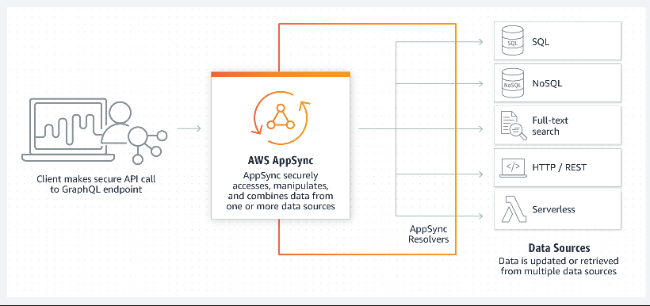

# DoD Sweat Equity

DoD is a cochair and has members of the OpenC2 Technical Committee,
has individual participants in the Security Posture Attribute
Collection and Evaluation
([PACE](https://github.com/opencybersecurityalliance/PACE/tree/main/docs/Arch))
OASIS Open Project,
and sponsors HII to participate in both OpenC2 and PACE.

## 1. Software/Application/Device Contributions
DoD's contributions to the CAW include development of:
* OpenC2 actuator profiles (both PACE and non-PACE related)
* Profile creation and message validation tools
* Posture Attribute Repository (PAR) proof of concept

### 1.1 OpenC2 Actuator Profiles

### 1.2 Profile Creation and Message Validation Tools
The OpenC2 [JADN Software]() repo contains:
* Template to use when creating new actuator profiles
* Template to use when developing OpenC2 producer and consumer device schemas
* Software to validate profile and device schemas
* Software to resolve external references to produce a combined schema
* Example actuator profile and device schemas
* Example OpenC2 commands and responses
* Software to validate commands and responses against a device schema

This software can be used both when creating new actuator profiles and when
developing and testing OpenC2 implementations prior to interoperability testing.

### 1.3 Posture Attribute Repository Proof of Concept
Decision-making components will be able to retrieve PACE information from a
Posture Attribute Repository.

Although a specific PAR API has not yet been determined, DoD will develop and make available a PAR proof of concept
implemented on Amazon Web Services using a [GraphQL](https://aws.amazon.com/appsync/) interface*.
CAW participants will be able to query a set of dummy components (IT assets) and a set of random
but syntactically valid example SBOMs associated with those components.
PAR content will be managed exclusively by the Posture Attribute Collection and
Posture Attribute Evaluation systems; all user access is query-only.

`*` [This article](https://www.onegraph.com/blog/post/2/how-onegraph-onboards-users-who-are-new-to-graphql)
provides some background on GraphQL capabilities and our rationale for using it as a PAR API.

**PAR Structure**

Every entry in the PAR has an ID, which must be globally unique and in the form of an
Internationalized Resource Identifier ([IRI](https://datatracker.ietf.org/doc/html/rfc3987)).
Initially the PAR will include two entry types: devices and SBOMs.
* A device is a physical or virtual processing element owned or managed by an organization.
A device entry includes asset identifying and configuration information
including the SBOM(s) applicable to that device.
* A Software Bill of Materials ([SBOM](https://ntia.gov/SBOM))
is a nested inventory for software, a list of ingredients that make up software components.
An SBOM entry includes the SBOM unique identifier, the seven
[SBOM minimum elements](https://www.ntia.doc.gov/files/ntia/publications/sbom_minimum_elements_report.pdf),
and the SBOM document in one of several types and data formats.

## 2. Which interfaces in which usecases

[return to Home](../../index.md)
